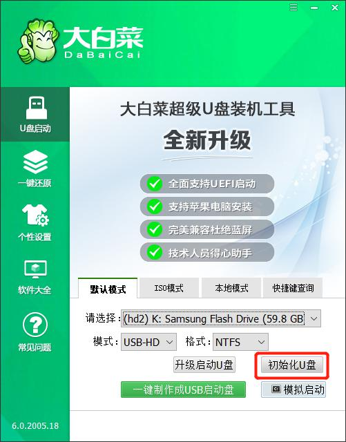
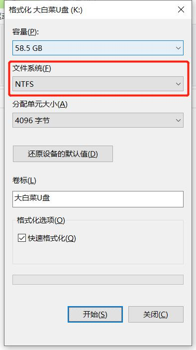
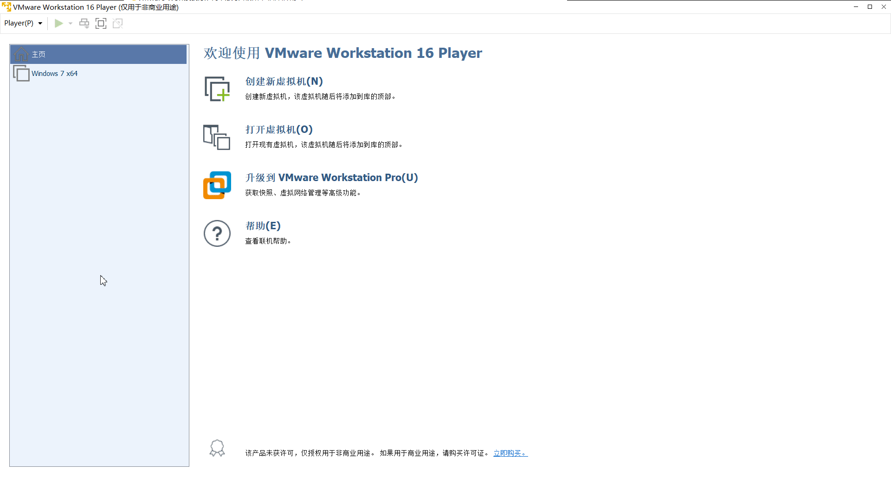

### 安装 Kali 到 U 盘
#### 1. 准备

- Kali，官网：[https://www.kali.org/](https://www.kali.org/ "https://www.kali.org/")
- VMware Workstation Player，官网：[https://www.vmware.com/](https://www.vmware.com/products/workstation-player.html "https://www.vmware.com/")
- U 盘

#### 2. 开始
1. 初始化 U 盘

2. 格式化 U 盘

3. 打开 VMware Workstation Player，并新建

4. Kali 开机