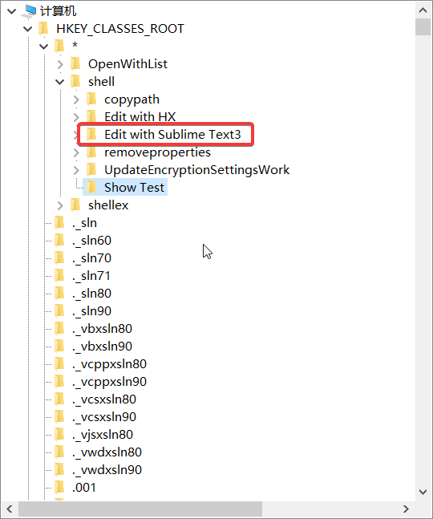
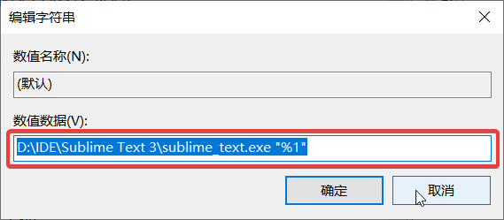

##### 把软件设置到文件/文件夹的右击菜单上


1. `win + R` 打开运行
2. 输入 `regedit` 打开注册表
3. 找到 `计算机\HKEY_CLASSES_ROOT\*\shell`

5. 然后在 `shell` 右击新增项，比如 `Edit with Sublime Text3`

6. 选中你新增加的项 `Edit with Sublime Text3` ，在右侧新增字符串值
	- 名称（ `Name` ）输入为 `icon` 
	- 然后选中 `icon`， 右击选择修改
	- 数值数据填入 `D:\IDE\Sublime Text 3\sublime_text.exe,0`（路径后面需加上 `,0` ）
	
7. 在左侧选中 `Edit with Sublime Text3` 右击，新建项 `Command`
	- 选中 `Command` ，在右侧的默认上右击修改
	- 填入 `D:\IDE\Sublime Text 3\sublime_text.exe "%1"`
> "%1"——%1 两边的双引号必加，这样才能打开路径带空格的文件或文件夹


  

9. 完成！效果如下


一键脚本
```
Windows Registry Editor Version 5.00
[HKEY_CLASSES_ROOT\*\shell\Edit with Sublime Text3]
@="Edit with Sublime Text3"
"Icon"="D:\\IDE\\Sublime Text 3\\sublime_text.exe,0"
[HKEY_CLASSES_ROOT\*\shell\Edit with Sublime Text3\command]
@="D:\\IDE\\Sublime Text 3\\sublime_text.exe \"%1\""

[HKEY_CLASSES_ROOT\*\shell\Edit with HX]
@="Edit with HX"
"Icon"="D:\\IDE\\HBuilderX.1.6.2.20190220.full\\HBuilderX\\HBuilderX.exe,0"
[HKEY_CLASSES_ROOT\*\shell\Edit with HX\command]
@="D:\\IDE\\HBuilderX.1.6.2.20190220.full\\HBuilderX\\HBuilderX.exe \"%1\""

[HKEY_CLASSES_ROOT\Directory\shell\Open to Sublime Text3]
@="Open to Sublime Text3"
"Icon"="D:\\IDE\\Sublime Text 3\\sublime_text.exe,0"
[HKEY_CLASSES_ROOT\Directory\shell\Open to Sublime Text3\command]
@="D:\\IDE\\Sublime Text 3\\sublime_text.exe \"%1\""

注意：双斜杠
D:\\IDE\\Sublime Text 3\\sublime_text.exe
文件名后缀：.reg
```
##### 添加软件到文件夹的右键菜单
> 按路径 `HKEY_CLASSES_ROOT\directory\shell` 在左侧依次打开，其余步骤和上面相同。
> 如果上面路径不存在，可依次创建。

##### 添加软件到文件及文件夹的右键菜单
> 按路径`HKEY_CLASSES_ROOT\AllFilesystemObjects\shell`在左侧依次打开，其余步骤和上面相同。
> 如果上面路径不存在，可依次创建。

参考链接：
[把软件添加到文件/文件夹的右键菜单、为文件和文件夹添加复制路径的右键菜单](https://blog.csdn.net/u013719339/article/details/80089243)
[Sublime text 添加到鼠标右键功能](https://blog.csdn.net/i_am_tomato/article/details/72818293 )
##### 为文件、文件夹添加复制路径的右键菜单
```registry
Windows Registry Editor Version 5.00

[HKEY_CLASSES_ROOT\Directory\shell\copypath]
@="Copy folder path"

[HKEY_CLASSES_ROOT\Directory\shell\copypath\command]
@="mshta vbscript:clipboarddata.setdata(\"text\",\"%1\")(close)"

[HKEY_CLASSES_ROOT\*\shell\copypath]
@="Copy file path"

[HKEY_CLASSES_ROOT\*\shell\copypath\command]
@="mshta vbscript:clipboarddata.setdata(\"text\",\"%1\")(close)"
```
参考链接：
[Windows右键菜单设置与应用技巧](https://www.cnblogs.com/russellluo/archive/2011/11/25/2263817.html)