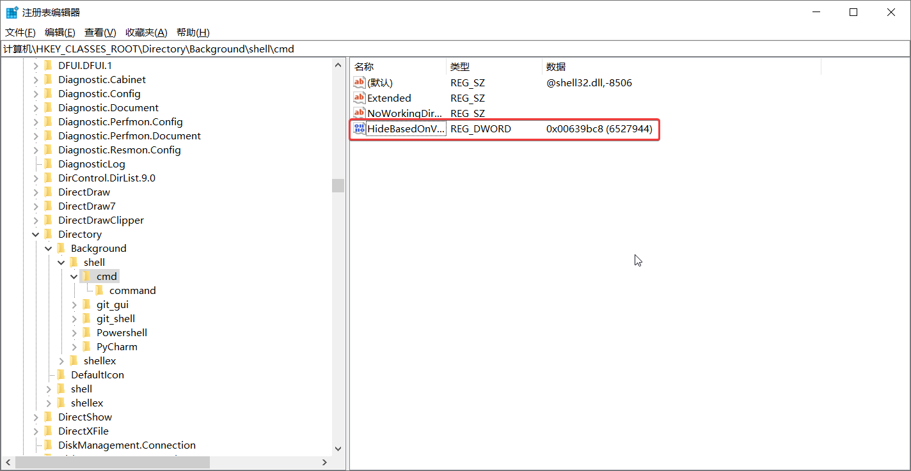
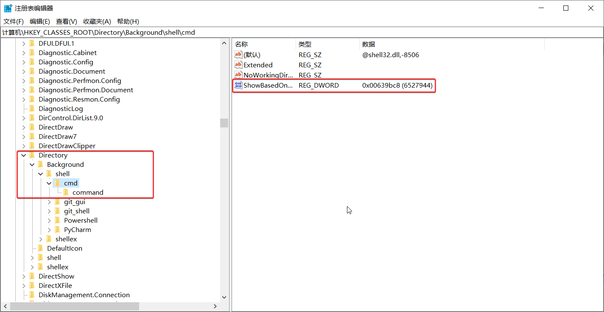
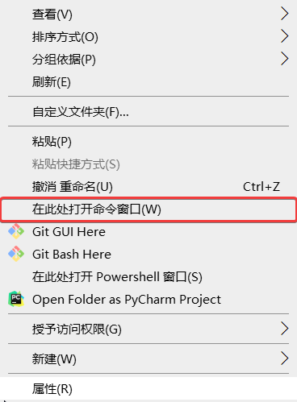

### Windows 10 下， shift + 右击打开 cmd 窗口

1. 打开注册编辑器，找到如下：
```
计算机\HKEY_CLASSES_ROOT\Directory\Background\shell\cmd
```


2. 将右侧的`HideBasedOnVelocityId`修改为`ShowBasedOnVelocityId`即可



3. 效果如下：



### finsh!
